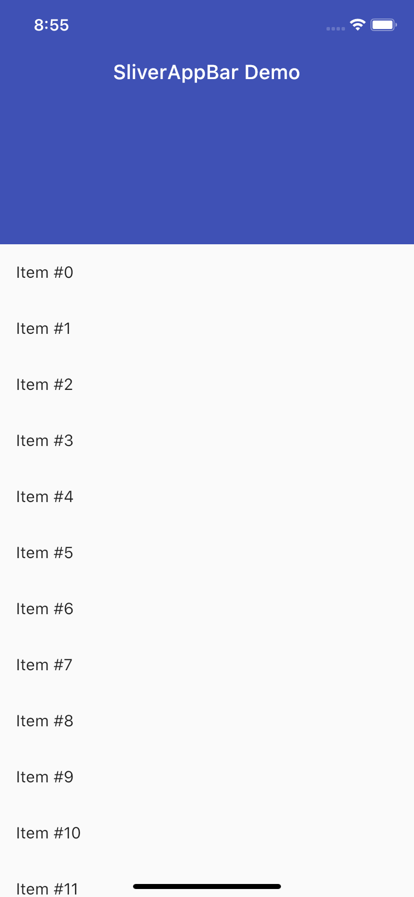
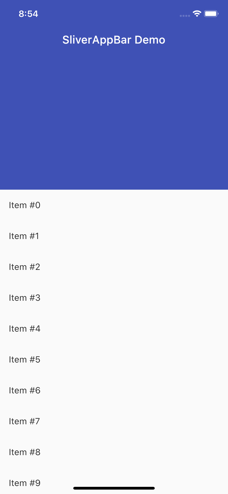
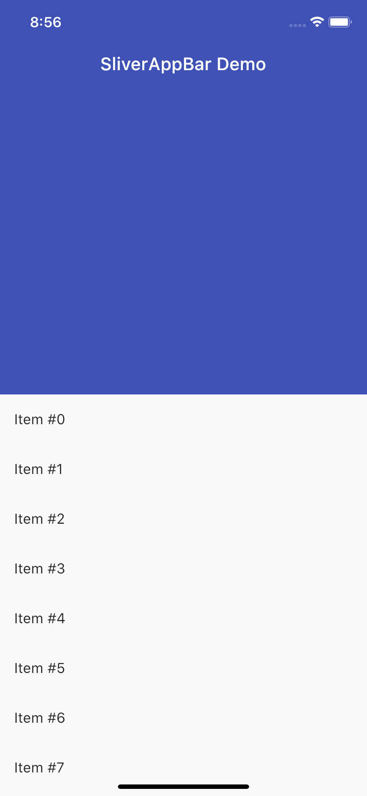
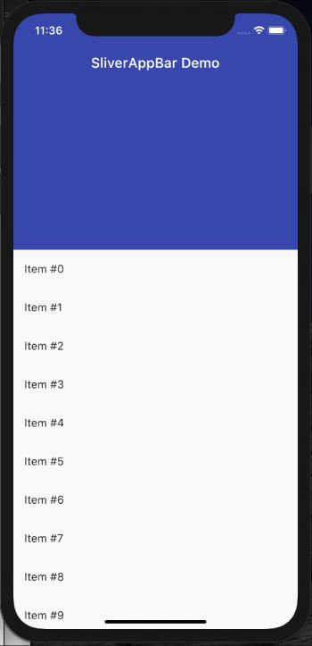
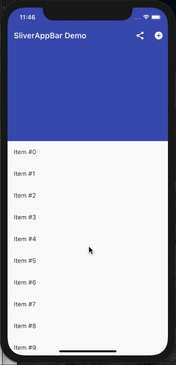
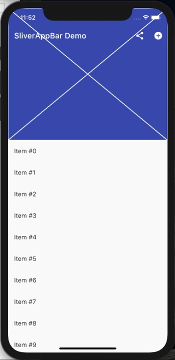
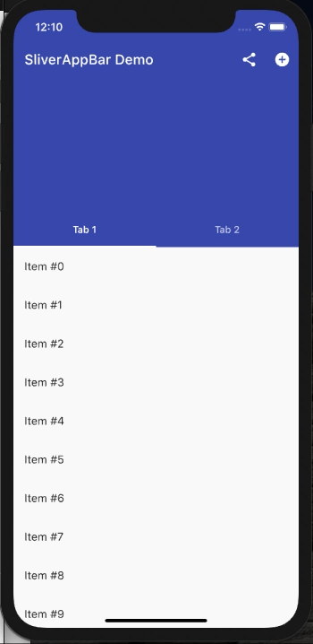

# SliverAppBar

Este proyecto ha sido creado para mostrar las capacidades del widget [SliverAppBar](https://api.flutter.dev/flutter/widgets/SliverAppBar-class.html) como parte de la asignatura **Nuevas tendencias en el desarrollo de aplicaciones móviles** en la [Universidad Oberta de Catalunya](https://www.uoc.edu).

La [**SliverAppBar**](https://api.flutter.dev/flutter/material/SliverAppBar-class.html) es el widget de la [Material Library](https://api.flutter.dev/flutter/material/material-library.html) de Flutter con el que podemos crear fácilmente una barra de navegación dinámica en la aplicación que muestre más contenido y sustituya a la típica [AppBar](https://api.flutter.dev/flutter/material/AppBar-class.html), ofreciendo un mundo nuevo de posibilidades.

## Introducción

La barra de navegación extendida o con colapso, es un componente de interfaz de usuario ampliamente utilizado en aplicaciones actuales. Consiste en mostrar una imagen o fondo en la parte superior de la pantalla, ocupando un espacio fijo, de modo que posteriormente, al desplazarse hacia arriba, el contenido cambie y se convierta en una barra de navegación predeterminada.

Son muchas las aplicaciones que la implementan, redes sociales como [Twitter](https://www.twitter.com/) o [Instagram](https://www.instagram.com/), servicios de contenido en streaming como [Spotify](https://www.spotify.com/) o [Youtube](https://www.youtube.com/), y muchas más que usan este tipo de barras de navegación dinamicas para ofrecer información o funcionalidad adicional que puede ser visualizada en cualquier momento por sus usuarios sin estorbar una vez comienza el desplazamiento.

## ¿Cómo la añadimos a nuestra app?

Por norma general se colocará dentro de un [CustomScrollView](https://api.flutter.dev/flutter/material/Scaffold-class.html), esto es debido a que este widget posee un atributo llamado [slivers](https://api.flutter.dev/flutter/widgets/CustomScrollView/slivers.html), donde debe ser incorporada nuestra SliverAppBar, en lugar de en la propiedad appBar del Scaffold, para así poder interactuar correctamente con lo que contenga la vista con _scroll_.

```dart
CustomScrollView(
          slivers: <Widget>[
            SliverAppBar(
              title: Text(title),
              expandedHeight: 300,
            ),
            /* Here we can add other widgets like SliverList */
        ]
)
```


## Atributos para modificar el aspecto:

Como todo widget en flutter, tenemos a nuestro alcance una serie de atributos para personalizarlo a nuestro gusto.

- **expandedHeight**

Se trata de un atributo primordial pues con el definimos la altura máxima de nuestra SliverAppBar según requiera nuestro diseño, lo vemos a continuación:





- **title**

Provee de un título estándar a nuestra SliverAppBar

- **floating**

Si está a true, permite revelar el app bar si comienza a desplazarse hacia arriba en cualquier punto de la vista.


- **pinned**

Con este atributo podemos configurar que la barra de navegación se muestre en todo momento o no.



- **stretch**

Si está a true, damos a nuestro SliverAppBar el comportamiento de un encabezado elastico, tal y como vemos:


Hasta el momento nuestro SliverAppBar quedaría implementado de la siguiente forma:

```dart
SliverAppBar(
    title: Text(title),
    floating: true,
    pinned: true,
    stretch: true,
    expandedHeight: 300,
),
```

## Atributos para añadir funcionalidad:

Habiendo visto atributos eminentemente visuales, pasamos a ver otros más enfocados en añadir a SliverAppBar funcionalidad.

- **actions**

Nos permite añadir una serie de acciones en la barra para su facil acceso:



- **flexibleSpace**

Sirve para añadir un widget que se apila detrás de la barra de herramientas y la barra de pestañas. Su altura será la misma que la altura total de la barra de aplicaciones.



Normalmente en lugar de un [Placeholder](https://api.flutter.dev/flutter/widgets/Placeholder-class.html), como en nuestro caso, lo habitual es colocar un [FlexibleSpaceBar](https://api.flutter.dev/flutter/material/FlexibleSpaceBar-class.html) como veremos más adelante.

> IMP: Para hacer uso de este atributo necesitaremos tener activado **stretch** previamente.

- **bottom**

Tambien tenemos la posibilidad de añadir un Tabbar a nuestro SliverAppBar con esta propiedad.



Habiendo añadido estos atributos el código de nuestro SliverAppBar quedaría de la siguiente forma:

```dart
SliverAppBar(
    title: Text(title),
    floating: true,
    pinned: true,
    stretch: true,
    expandedHeight: 300,
    flexibleSpace: Placeholder(),
    actions: <Widget>[
        IconButton(
            icon: const Icon(Icons.share),
            onPressed: () {/* Some call function */},
        ),
        IconButton(
            icon: const Icon(Icons.add_circle),
            onPressed: () {/* Some call function */},
        ),
    ],
    bottom: TabBar(
        tabs: [
            Tab(text: 'Tab 1'),
            Tab(text: 'Tab 2'),
        ],
    ),
),
```

## Personalizando más nuestra SliverAppBar

Hasta ahora hemos visto de forma básica que podemos hacer con SliverAppBar, vamos a aprovechar sus bondades para construir una interfaz algo más compleja con una barra de navegación con colapso que además contenga tabs para cambiar de vista.

### Caracteristicas del ejemplo

En el proyecto implementado para demostrar el uso de este widget:

1. Hemos creado una SliverAppBar con una altura máxima de 350px, flotante, fija y estirable.
2. La hemos configurado para tener acciones de acceso rápido.
3. Le hemos añadido un [FlexibleSpaceBar](https://api.flutter.dev/flutter/material/FlexibleSpaceBar-class.html), para poner una imagen de fondo y que se estire con la SliverAppBar.
4. También hemos incluido una TabBar con dos pestañas, para ello hemos tenido que hacer uso de [SliverFillRemaining](https://api.flutter.dev/flutter/widgets/SliverFillRemaining-class.html) para llenar el espacio restante en la pantalla con nuestros tabs y [SingleTickerProviderStateMixin](https://api.flutter.dev/flutter/widgets/SingleTickerProviderStateMixin-mixin.html) para que nos permita cambiar entre ellos.

A continuación un [video demostrativo](https://youtu.be/ef7X7A78EAk "SliverAppBar Demo").

## Conclusiones

Como hemos podido vislumbrar, la SliverAppBar es un widget muy versatil, sencillo de utilizar y da a nuestra app la posibilidad de potenciar la barra de navegación, sin embargo, antes de utilizarla deberíamos considerar lo siguiente:

- La SliverAppBar se puede aplicar en cualquier vista pero principalmente encaja en perfiles de usuario y vistas de detalle complejas con varias pestañas, por ejemplo para mostrar un producto en un _mcommerce_, lugares o eventos.

- No recomendamos utilizar esta barra si no queremos mostrar algun contenido extra como una imagen en ella. En este caso mejor usar la [AppBar](https://api.flutter.dev/flutter/material/AppBar-class.html).

- Para aprovechar al completo sus bondades, debemos hacer uso de otros widgets como SliverList, FlexibleSpaceBar o SliverFillRemaining, lo que puede complicar su implementación.

## Referencias

- [Flutter API: SliverAppBar](https://api.flutter.dev/flutter/material/SliverAppBar-class.html)

- [Flutter Cookbook: Place a floating app bar above a list](https://flutter.dev/docs/cookbook/lists/floating-app-bar)

- [Widget of the Week (11): SliverAppBar](https://youtu.be/R9C5KMJKluE)

- [Widget of the Week (84): SliverAppBar](https://youtu.be/mSc7qFzxHDw)
